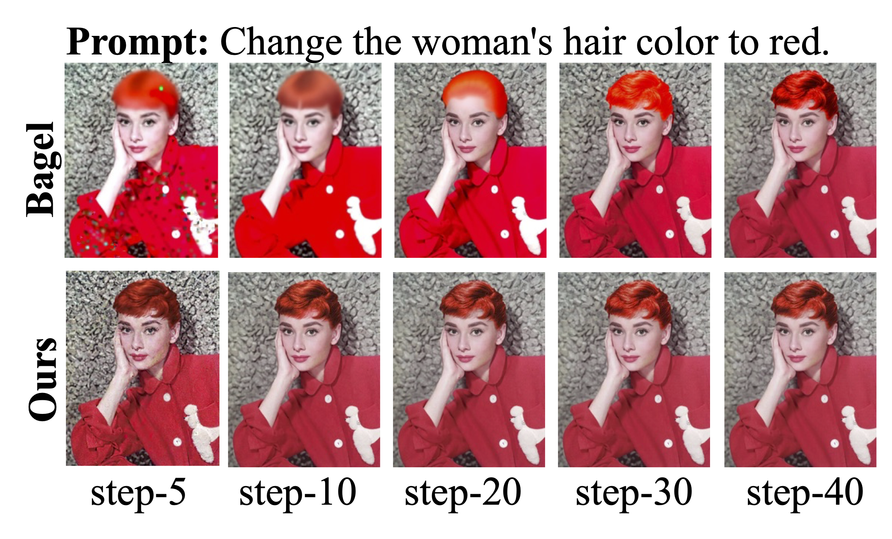

<div style="text-align: center; background-color: #FFFFFF;">
<p align="center">
  <a href="https://zan.chat">
    
  </a>
</p>
</div>

<h1 align="center">LGCC: Fast and Detail-Enhanced Image Editing (Fast-BAGEL)</h1>

<p align="center">
  <strong>Official implementation of our paper: "LGCC: Enhancing Flow Matching Based Text-Guided Image Editing with Local Gaussian Coupling and Context Consistency"</strong>
</p>

<p align="center">
  <a href="https://zan.chat/fast-bagel">
    
  </a>
  <a href="https://arxiv.org/abs/2505.14683">
    
  </a>
  <a href="https://huggingface.co/zanchat-ai/fast-bagel">
    
  </a>
    <a href="https://demo.bagel-ai.org/">
    
  </a>
  <a href="mailto:info@zan.chat">
    
  </a>
</p>

---

**LGCC** (publicly released as **Fast-BAGEL**) is a novel framework that addresses key limitations in flow matching-based image editing models like [BAGEL](https://github.com/google/bagel). Existing methods often suffer from **detail degradation**, **content inconsistency**, and **slow inference speeds**. Our framework introduces two core innovations—**Local Gaussian Noise Coupling (LGNC)** and **Content Consistency Loss (CCL)**—to deliver faster, more detailed, and context-aware image edits.

## ✨ Key Contributions

-   🚀 **Drastic Inference Speed-Up:** Achieves a **2x speedup** for universal editing and a **3x–5x speedup** for lightweight edits, requiring only 40%–50% of the inference time of BAGEL or Flux.
-   ✨ **Superior Detail Preservation (LGNC):** Improves local detail scores on I2EBench by **1.60%** by preserving fine-grained spatial information during the editing process.
-   🧠 **Enhanced Content Consistency (CCL):** A novel loss function that ensures semantic alignment between the text prompt and the image, preventing unintended removal or alteration of background content.
-   🧩 **Efficient Finetuning:** Successfully integrated with the powerful pre-trained BAGEL model via curriculum learning, demonstrating a highly effective and data-efficient training strategy.

## 📊 Performance Benchmarks

LGCC significantly outperforms existing baselines in both quality and efficiency.

### Quality Improvement (on I2EBench)

| Metric                 | Improvement vs. BAGEL |
| ---------------------- | :-------------------: |
| Local Detail Score     |      **+1.60%**       |
| Overall Edit Score     |      **+0.53%**       |

### Inference Speed-Up

| Edit Type          | Speed-Up Factor | Inference Time vs. BAGEL/Flux |
| ------------------ | :-------------: | :---------------------------: |
| Lightweight Editing |    **3x–5x**    |           **~40%**            |
| Universal Editing   |      **2x**       |           **~50%**            |


*Fig. 1: LGCC (Fast-BAGEL) achieves superior or comparable quality in just 20-30 steps, while the original BAGEL requires 50 steps.*
## 🔬 The LGCC Framework

Our framework introduces two key components to enhance the flow-matching pipeline:

### 1. Local-Gaussian Noise Coupling (LGNC)
To combat detail degradation, LGNC abandons random noise initialization. Instead, it models the target image embeddings and their locally perturbed counterparts as coupled pairs. This preserves essential spatial details from the source image throughout the diffusion trajectory. The implementation is remarkably simple:

```python
# LGNC: Aligning noise with local latent characteristics to preserve detail
sigma = 0.9  # Coupling strength
epsilon = torch.randn_like(packed_latent_clean)

# Align the noise with the local latent distribution
align_epsilon = epsilon * latent_std + latent_mean

# Couple the aligned noise with the clean latent for a detail-aware trajectory
coupled_noise = packed_latent_clean + sigma * align_epsilon
```

### 2. Content Consistency Loss (CCL)
CCL is a novel loss function designed to prevent content "hallucination" or unintended alterations. It enforces semantic alignment between the editing instructions and the final image, ensuring that only the specified regions are modified while the rest of the image content remains consistent.

## 🚀 Getting Started

### Prerequisites
-   Python 3.8+
-   PyTorch 2.0+
-   `diffusers`, `transformers`, and other standard ML libraries.

### Installation & Model Download
Clone this repository and download the model weights from our [Hugging Face repository](https://huggingface.co/zanchat-ai/fast-bagel).

```shell
git clone https://github.com/ZanChat/fast-bagel.git
cd fast-bagel

# Download the model from Hugging Face (https://huggingface.co/zanchat-ai/fast-bagel)  and place it in a designated directory
# For example: /path/to/models/fast-bagel
```

### Running Inference
Run the inference script to test the model. You can specify different numbers of timesteps to observe the trade-off between speed and quality.

```shell
# Example: Run inference with 20, 40, and 50 steps
CUDA_VISIBLE_DEVICES=0 python inference_ds.py \
  --model_dir /path/to/models/fast-bagel \
  --num_timesteps=20,40,50 \
  --time_shift=4
```
-   `--model_dir`: Path to the downloaded Fast-BAGEL (LGCC) model.
-   `--num_timesteps`: A comma-separated list of inference steps to test. 50 steps are recommended for high-quality results.

## ✍️ Citation
If you find our work useful for your research, please cite our paper:

```bibtex
@article{liu2025-fast-bagel,
  title   = {LGCC: Enhancing Flow Matching Based Text-Guided Image Editing with Local Gaussian Coupling and Context Consistency},
  author  = {Fangbing Liu and Pengfei Duan and Wen Li and Yi He},
  journal = {arXiv preprint arXiv:2505.14683},
  year    = {2025}
}
```

# old contents of original BAGEL

**Original README from ByteDance Bagel**
see [OLD_README.md](OLD_README.md)